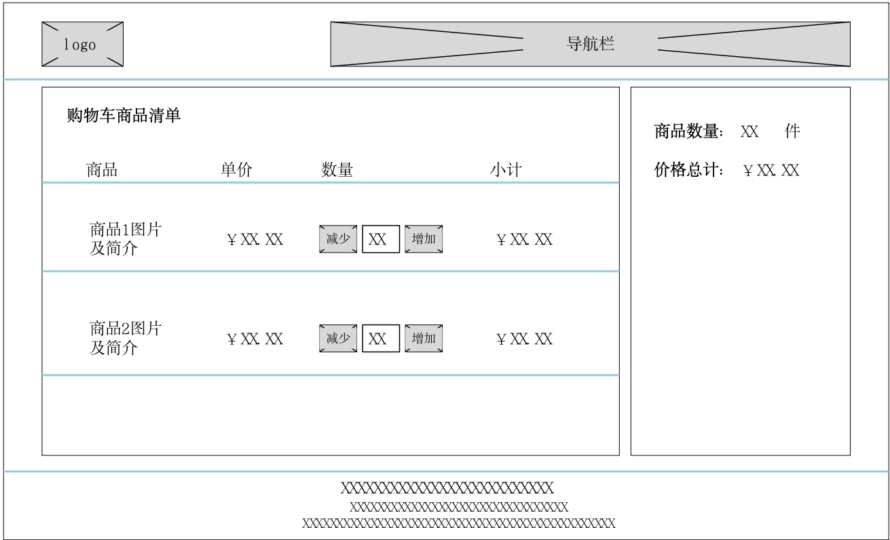

# 《网页制作与网站建设》实践环节考核试题
2024年10月

## 任务描述及要求
图1为某电子商务网站的购物车页面草图。请根据图1及其后的设计说明制作页面，撰写实践报告并提交。

图1 购物车页面草图
图1页面是购物车页面，页面设计说明如下：

1. 页面采用三字型布局：顶部为页头区，中间为内容区和底部为页脚区。页头区左侧是站点logo，中间及右侧是站点导航栏。内容区分为左右两个子区域，左侧子区域为购物车详情区，右侧子区域为购物车概览区。页脚区为公司信息区，包括公司注册信息及地址等信息。
2. 各区域无外边框。图1中各区域的外边框只是为了标识区域。
3. 公司logo为图片。
4. 导航栏包含超链接。如果没有实际链接目标URL，可使用空连接。
5. 购物车详情区商品列表不少于两条。每个商品条目中的商品图片及简介请你自己给出实际内容。数量列的中间元素为文本框，初始值为整数1，“减少”、“增加”均为按钮。用户点击“增加”按钮，数量文本框中的数值增加1。用户点击“减少”按钮，数量文本框中的数值减少1。用户也可以在数量文本框中直接输入整数。数量文本框中的整数值变化之后，小计列的金额数值自动更新。商品数量大于等于0。
6. 购物车概览区的商品实际数量和实际的总计价格随购物车详情区的信息变化自动更新。
7. 其它未做说明之处请你自己根据需要自行决定。
## 实践报告提交要求
按照任务描述及要求完成作品，之后编写实践报告并提交。
## 实践报告内容及顺序：
1. 页面截图。
2. 页面源代码。注意，要直接将页面源代码文本粘贴到文档中，不要粘贴代码截图。
评价标准
1. 页面元素及布局符合页面草图及设计说明。（30分）
2. 使用 CSS 实现页面元素布局、设置页面元素样式。（30分）
3. 使用 JavaScript 脚本代码实现购物车详情区商品数量增减、小计金额自动更新，购物车概览区商品数量自动更新、总计价格金额自动更新。（30）
4. 页面美观和谐，字体、字号、色彩搭配合理。（10分）
5. 雷同作品统一赋值0分。[特别注意]

